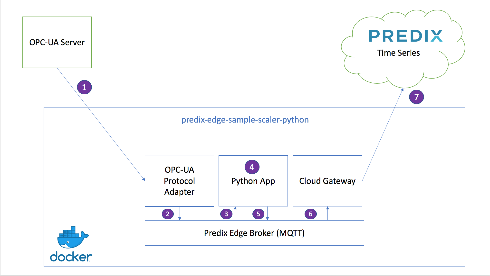

# Predix Edge Sample Scaling App in Python

The intent of this app is to illustrate building and deploying a basic Predix Edge app that communicates with other common Predix Edge container services.  The functionality is intended to be extremely simple with the focus being on the fundamentals of constructing the app.

## Architecture of Sample App

The OPC-UA Protocol Adapter, the Predix Edge Broker, the Cloud Gateway, and the Python App work as a multi-container Docker application. As the application is currently configured, it data will flow through the diagram in seven stages:

1. The OPC-UA Protocol Adapter subscribes to data with particular tags (configured [here](config/config-opcua.json)) coming from an OPC-UA server.
2. The OPC-UA Protocol Adapter publishes that data to the Predix Edge MQTT Broker on the topic "app_data".
3. The Python app subscribes to data from the Predix Edge MQTT Broker with the topic "app_data".
4. The Python app modifies the data. In this case, it multiplies it by 1000, but you can change it to modify it any way you would like. It then tags the data with the tag "original-tag-name-here.scaled_x_1000".
5. The Python app publishes that data to the Predix Edge MQTT Broker on the topic "timeseries_data". (Note: it is not a requirement to publish to the same topic you subscribed to.)
6. The Cloud Gateway subscribes to data from the Predix Edge MQTT Broker with the topic "timeseries_data".
7. The Cloud Gateway publishes data to Predix Time Series.




## Running the App

There are three different ways in which you can run your application.

 - Download the App tar, deploy to Predix Edge OS and run in a Predix Edge OS VM.
 - Run all the containers locally on your machine
 - Run all the containers locally on your machine, except for the python code, for development or debugging purposes.

## Running in Predix Edge

### Getting a Predix Edge VM

Please follow the [documentation](https://docs.predix.io/en-US/content/service/edge_software_and_services/predix_edge_os/predix-edge-os-image) to install a Predix Edge OS Developer VM on your computer

### Retrieve the App tar and config.zip

Using a browser, follow the same [login documentation](https://docs.predix.io/en-US/content/service/edge_software_and_services/predix_edge_os/installing-predix-edge-os-virtual-machine) to log in to [Artifactory](https://artifactory.predix.io).

Then visit the url where the Sample applicaton tar files are located

https://artifactory.predix.io/artifactory/webapp/#/artifacts/browse/tree/General/PREDIX-EXT/predix-edge/samples/com/ge/predix/edge/app

Next, download the sample application tar.  For reference, the application tar consists of:

 - images.tar - Docker containers that comprise the Edge Application
 - [docker-compose.yml](https://github.com/PredixDev/predix-edge-sample-scaler-python/blob/master/docker-compose.yml) - an app descriptor that is used to the launch the Docker containers.  

 Also, in Artifactory, download the Config.zip file for the app.  For reference, in this application, the config.zip consists of one confg file for 3 of the containers in this 4 container app.

  - [config-simulator.json](https://github.com/PredixDev/predix-edge-sample-scaler-python/blob/master/config/config-simulator.json)
  - [config-opcua.json](https://github.com/PredixDev/predix-edge-sample-scaler-python/blob/master/config/config-opcua.json)
  - [config-cloud-gateway.json](https://github.com/PredixDev/predix-edge-sample-scaler-python/blob/master/config/config-cloud-gateway.json)

Note the config-cloud-gateway.json will not be sending to your timeseries until it is updated with a Predix Time Series Zone Id.  

### Upload Application and Config to PETC

Predix Edge Technician Console is an App that is already running in Predix Edge OS.  

Using a browser, follow the [instructions](https://docs.predix.io/en-US/content/service/edge_software_and_services/predix_edge_device_configuration_and_enrollment/) to log in.

Navigate to the `Applications Manager` and under the `Actions` dropdown, upload the Application tar.

Next `Deploy` it.

Finally, `upload` the Config.zip.  You will see the App stopping and restarting.

You should see the App in a `Running` status.

### Validating the results

If you visit the simulator config file, [config-simulation.json](https://github.com/PredixDev/predix-edge-sample-scaler-python/blob/master/config/config-simulator.json), you will see

```json
[
    {"browseName": "Simulator.Device1.FLOAT1", "frequency": 1000, "random": {"dataType": "Double", "min": 0, "max": 0.5, "precision": 4}},
    {"browseName": "Simulator.Device1.FLOAT2", "frequency": 1000, "counter": {"dataType": "Double", "start": 1.10, "min": 1.10, "max": 4.40, "increment": 1.10 }},
    {"browseName": "Simulator.Device1.FLOAT3", "frequency": 1000, "counter": {"dataType": "Integer", "start": 1, "min": 1, "max": 1000, "increment": 1 }},
    {"browseName": "Simulator.Device1.FLOAT4", "frequency": 1000, "counter": {"dataType": "Integer", "start": 1, "min": 1, "max": 1000, "increment": 10 }},
    {"browseName": "Simulator.Device1.FLOAT5", "frequency": 1000, "counter": {"dataType": "Integer", "start": 1, "min": 1, "max": 1000, "increment": 20 }},
    {"browseName": "Simulator.Device1.FLOAT6", "frequency": 1000, "counter": {"dataType": "Integer", "start": 1, "min": 1, "max": 1000, "increment": 30 }},
    {"browseName": "Simulator.Device1.FLOAT7", "frequency": 1000, "counter": {"dataType": "Integer", "start": 1, "min": 1, "max": 1000, "increment": 40 }}
]
```
If you visit the OPCUA Adapter config file, [config-opcua.json](https://github.com/PredixDev/predix-edge-sample-scaler-python/blob/master/config/config-opcua.json), you will see how the simulator fields get mapped to Time Series `alias` tag names.

```json
"data_map": [
              {
                "alias": "Compressor-CMMS-Compressor-2018.crank-frame-compressionratio",
                "id": "ns=1;s=Simulator.Device1.FLOAT1"
              },
              {
                "alias": "Compressor-CMMS-Compressor-2018.crank-frame-dischargepressure",
                "id": "ns=1;s=Simulator.Device1.FLOAT2"
              },
              {
                "alias": "Compressor-CMMS-Compressor-2018.crank-frame-suctionpressure",
                "id": "ns=1;s=Simulator.Device1.FLOAT3"
              },
              {
                "alias": "Compressor-CMMS-Compressor-2018.crank-frame-maximumpressure",
                "id": "ns=1;s=Simulator.Device1.FLOAT4"
              },
              {
                "alias": "Compressor-CMMS-Compressor-2018.crank-frame-minimumpressure",
                "id": "ns=1;s=Simulator.Device1.FLOAT5"
              },
              {
                "alias": "Compressor-CMMS-Compressor-2018.crank-frame-temperature",
                "id": "ns=1;s=Simulator.Device1.FLOAT6"
              },
              {
                "alias": "Compressor-CMMS-Compressor-2018.crank-frame-velocity",
                "id": "ns=1;s=Simulator.Device1.FLOAT7"
              }
            ]
```

Next, visit the PETC Logs UI screen.  Choose:

1. App - Service Name
2. predix-edge-sample-scaler-python
3. cloud-gateway-timeseries
4. Additonal Options
5. Message Priority = Debug
6. The log viewer only shows the first 20 rows in the date range, so you might need to narrow the range
7. Click the Update Preview button

You will see the up-scaled data and can compare it to the raw data in the 'opcua' adapter logs.  You may have to download the log files in order to find the matching timestamp.

You will also see that the Scaler app changed the name of the tag, adding ".scaled_x_1000"

```log
Feb 28 03:23:52 predixedge b35f5fc9ed5b[319]: {"messageId":"flex-pipe","body":[{"datapoints":[[1551324232686,3300,3]],
"name":"Compressor-CMMS-Compressor-2018.crank-frame-dischargepressure.scaled_x_1000","attributes":{"machine_type":"opcua"}}]}
```

## Running Locally in Docker

### Software You will Need

In order to develop and run this sample locally you will need:
* [**Docker**](https://www.docker.com/)
* The *UAA URL*, *ClientID* and *Secret* for the Predix Cloud Time Series service to which you wish to ingest the app's output.

### Step 1: Install the core Predix Edge components

To get started developing locally you will need to pull the core Predix Edge Docker images onto your local machine.  

Install the Predix Edge Broker

Using a browser, log in to https://artifactory.predix.io using your predix username and password. GE users will use the SSO feature to login, use your SSO where it says your-predix-account below.

Click the `Artifacts` icon and navigate to the predix-ext/predix-edge/<latest-version-here>/os folder and Download the `edge-broker` container.
**Changing the** command to use the **version** you downloaded, using a tool on your computer, untar it, e.g.

```bash
tar -xvf predix-edge-broker-amd64-<your version here>.tar.gz
```

change directory

```bash
cd predix-edge-broker-amd64-<your version here>
```

Load the image in to your local Docker repository

```bash
docker load -i *.tar
```

Now repeat the steps for the OPCUA Adapter and Cloud Gateway
```bash
predix-ext/predix-edge/<latest-version-here>/apps/adapters/<latest-opcua-adapter-here>
```
```bash
predix-ext/predix-edge/<latest-version-here>/apps/gateway/<latest-cloud-gateway-here>
```

Finally, create a [Docker Swarm](https://docs.docker.com/engine/swarm/) on your machine.  You only need to do this once on your machine.  If you have done so in the past you can disregard this step.

```bash
docker swarm init
```

### Step 2: Clone this Repository

Clone this repository to download all of the source code.
```bash
git clone https://github.com/PredixDev/predix-edge-sample-scaler-python.git
```

### Step 3: Review the App Functionality
The functionality of this Python app is located in a the **src** folder in a file named **app.py**.  Please review the file and the comments around each line to understand how it works.


### Step 4: Create a Docker image of the App

The [Dockerfile](https://docs.docker.com/engine/reference/builder/) is used to compile your app into a Docker image that can be run in Predix Edge. Please review the file and the comments around each to understand how it works.


The *docker build* command is used to generate the docker image from the source code of your app.  Executing this command from the command-line will create a Docker image named **predix-edge-sample-scaler-python** with the current version.

Changing **latest** to match current version, build the container. The version should match what is in the docker-compose-local.yml.

```bash
docker build -t predixedge/predix-edge-sample-scaler-python:<latest-version-here> .
```

If your build machine is behind a proxy you will need to specify the proxies as build arguments.  You can pull in the proxy values from the environment variables on your machine.

```bash
docker build --build-arg http_proxy=$http_proxy --build-arg https_proxy=$https_proxy -t predixedge/predix-edge-sample-scaler-python:<latest-version-here> .
```

After the build completes you can see your image, as well as the core Predix Edge images we pulled onto your machine with the *docker images* command.

```bash
docker images
```

### Step 5: Configure the App
Predix Edge apps contain a series of configuration files to define parameters for the app's deployment and execution. Our app contains the following configuration files.

### docker-compose.yml
App deployment parameters are defined in the **docker-compose.yml** file.  This file specifies the Docker images used to construct the application.  It also contains parameters for configuring the image, such as any specific configuration files required by each image.

Our project includes three variations on the *docker-compose.yml* file: *docker-compose-dev.yml*, *docker-compose-docker.yml*, and *docker-compose.yml*.  The "-dev" version is configured to run the app locally on your machine. The "-docker" version is configured to run the application in a Docker container on your machine. The other version is configured to run on Predix Edge OS.

Our project includes these files:

 - **docker-compose-edge-broker.yml** - use to run the MQTT Data Broker on your machine
 - **docker-compose-local.yml** - use to run all the app containers on your machine
 - **docker-compose-dev.yml** - use to run all the app containers on your machine, except for the python code, for development or debugging purposes.

The primary differences between *docker-compose.yml* and the "-dev" and "-docker" versions are are:

- Removal of all volume mounts.  Predix Edge will automatically inject **/config**, **/edge-agent** and **/data** volume into your app at runtime.
- Removal of Proxy and DNS settings.  Apps running on a Predix Edge device will utilize these values configured on the device.
- Removal of the predix-edge-broker service.  This service is pre-installed on the Predix Edge VM.


Notice that, for the Cloud Gateway service, the "-local" and "-dev" version of the config file set the proxy settings to use the ``$https_proxy`` environment variable from your machine (or in the docker container).  Change the **https_proxy** value if your machine is behind a different proxy.

```yaml
  cloud_gateway:
    image: "dtr.predix.io/predix-edge/cloud-gateway:amd64-latest"
    environment:
      config: "/config/config-cloud-gateway.json"
      https_proxy: "$https_proxy"
```

### config/config-opcua.json
This configuration file is utilized by the OPC-UA Protocol Adapter image to connect to an OPC-UA server, subscribe to a series of 3 tags and publish the results on the MQTT broker in a Time Series format.  It is configured to use an OPC-UA simulator running on the GE network.  Unless you would like to connect to a different server or simulator, you should not have to change this file.

Below is a subset of the config file highlighting key properties you would change if obtaining data from a different OPC-UA server:

- **transport_addr** - the IP address or URL to the OPC-UA server
- **data_map** - the array of tags the app is subscribing to
- **node_ref** - in the mqtt section is the topic on which the OPC-UA data will be published to on the MQTT broker for consumption by the other containers in the app

```json
    "opcua": {
      "type": "opcuasubflat",
      "config": {
          "transport_addr": "opc-tcp://opcua-simulator:4334/UA/PredixEdge",
          "log_level": "debug",
          "data_map": [
            {
              "alias": "Integration.App.Device1.FLOAT1",
              "id": "ns=2;s=Simulator.Device1.FLOAT1"
            },
            {
              "alias": "Integration.App.Device1.FLOAT2",
              "id": "ns=2;s=Simulator.Device1.FLOAT2"
            },
            {
              "alias": "Integration.App.Device1.FLOAT3",
              "id": "ns=2;s=Simulator.Device1.FLOAT3"
            }
          ]
      }
    },
    "mqtt": {
        "type": "cdpout",
        "config": {
            "transport_addr": "mqtt-tcp://predix-edge-broker",
            "node_ref": "opcua_data",
            "method": "pub",
            "log_level": "debug",
            "log_name": "opcua_mqtt"
        }
    }
```

### config/config-cloud-gateway.json
This file is used by the Cloud Gateway service and contains properties indicating which Predix Cloud Time Series service to publish the data to.

- **transport_addr** - (in the Time Series section) is the websockets URL for your Predix Cloud Time Series service.  
- **predix_zone_id** - (in the Time Series section) is the zone ID of the Time Series service you with to transmit the data to
- **node_ref** - (in the mqtt section) is the topic on which the Cloud Gateway service will subscribe to data published by the app to be injected into the Time Series database.  If you recall the sample app source code, **timeseries_data** is the topic to which the scaled values are put back on the broker.

**Action**: *You should change the value of **predix_zone_id** and ingestion URL to match the Predix Time Series service to which you intend to publish data when running this sample.*

```json
  "time_series_sender": {
      "type": "timeseries",
      "config": {
          "log_name": "ts_sender",
          "log_level": "debug",
          "mqtt": {
              "transport_addr": "mqtt-tcp://predix-edge-broker",
              "qos": 2,
              "client_id": "time_series_sender_mqtt_client",
              "topics": [
                  "app_data"
              ]
          },
          "store_forward": {
              "policy": "store_always",
              "max_store_size": 90,
              "max_store_size_units": "%",
              "max_batch_interval": 1000
          },
          "timeseries": {
              "transport_addr": "wss://gateway-predix-data-services.run.aws-usw02-pr.ice.predix.io/v1/stream/messages",
              "predix_zone_id": "your-predix-zone-id",
              "token_file": "/edge-agent/access_token",
              "proxy_url": "$https_proxy"
          }
      }
    }
```

### Step 6. Run the App and Validate the Results

#### Step 1: Get Access Token

The result of this app is to publish a scaled value to Predix Cloud Time Series.  In order to do so, the app requires a UAA token with permissions to ingest data.  On a Predix Edge device, apps obtain this token from the device once it is enrolled to Edge Manager.

During development, though, you must generate a token to be used by the app.  To do so, we have included a **get-access-token.sh** script that will obtain a UAA token and put it in a location that is accessible by the app.

The script takes three input parameters:
- `my-client-id` - the client id for your instance of UAA: it must have permissions to ingest data into your Time Series instance
- `my-secret` - the client secret for that client id
- `my-uaa-url` - must be the full URL including the /oauth/token ending

```bash
./scripts/get-access-token.sh my-client-id my-secret my-uaa-url
```

After you run the script, a file named *access_token* will be created in the data folder of the app.  The app is configured to use this file to obatin the token for transmitting data to the cloud.

#### Option 1: Run all the containers on your machine

##### Step 1: Run the Application

Start the Data Broker.  It is recommended to run this as a separate docker stack becuase the broker can be used with multiple applications and Predix Edge OS is shipped with the Broker already running.  Execute the following command from the commandline.  

```bash
docker stack deploy --compose-file docker-compose-edge-broker.yml predix-edge-broker
```

Now run the application

```bash
docker stack deploy --compose-file docker-compose-local.yml my-edge-app
```

##### Step 2: Check Status of Application
```bash
$ docker ps -a
```

You can view the logs generated by each container in the app by executing the docker logs command and passing in the CONTAINER ID for any of the running containers.

For example (where 0000000000 is one of the container ids displayed from your docker ps output):

```bash
$ docker logs 0000000000
```


#### Option 2: Run all the containers on your machine, except for the Python code

This is very similar to Option 1, only instead of running the application in a Docker container, you run it locally on your machine.

### Software You will Need

In order to develop and run this sample locally you will need:
* [**Python 3**](https://www.python.org/)

To download dependencies, run `pip3 install -r requirements.txt`. Unit tests are in the [test](test/) directory. To run the tests, run `python3 setup.py test`.


##### Step 1: Run the other containers of the Application

Start the Data Broker.  It is recommended to run this as a separate docker stack becuase the broker can be used with multiple applications and Predix Edge OS is shipped with the Broker already running.  Execute the following command from the command line.  

```bash
docker stack deploy --compose-file docker-compose-edge-broker.yml predix-edge-broker
```

Now run the other containers of the application

```bash
docker stack deploy --compose-file docker-compose-dev.yml my-edge-app
```

##### Step 2: Start Your Application

```bash
python3 src/app.py local
```

##### Step 3: Check Status of Application
```bash
docker ps -a
```

You can view the logs generated by each container in the app by executing the docker logs command and passing in the CONTAINER ID for any of the running containers.

For example (where 0000000000 is one of the container ids displayed from your docker ps output):

```bash
$ docker logs 0000000000
```

#### Option 3: Package and Deploy the App to a Predix Edge VM

Packaging the app involves creating a tar.gz file with your app's Docker images and docker-compose.yml file.  You then create a zip file containing your app's configuration files.

Note, you do not need to package the Predix Edge Broker image as it is already installed on the Predix Edge VM.

**Changing the** command to use the **version** you downloaded, create the **app.tar.gz** file:
```bash
$ docker save -o images.tar predixedge/predix-edge-sample-scaler-python:<latest-version-here> dtr.predix.io/predix-edge/protocol-adapter-opcua:amd64-<latest-version-here> dtr.predix.io/predix-edge/cloud-gateway:amd64-<latest-version-here>

$ tar -czvf app.tar.gz images.tar docker-compose.yml
```

Create the **config.zip** file.  

*Note, you only want to zip up the actual files, not the config folder that contains the files*.

```bash
$ cd config
$ zip -X -r ../config.zip *.json
$ cd ../
```

Once you have created these two files, you can upload them to your Edge Manager's repository and deploy them to your enrolled Predix Edge VM.

#### Verify the App Data
If the app is working, you should see a tag named **My.App.DOUBLE1.scaled_x_1000** in your Predix Cloud Time Series service.  Use a tool such as Postman or the [Predix Tool Kit API Explorer](https://predix-toolkit.run.aws-usw02-pr.ice.predix.io/#!/apiLoginClient) to query timeseries and view your data.

[](https://github.com/PredixDev)
